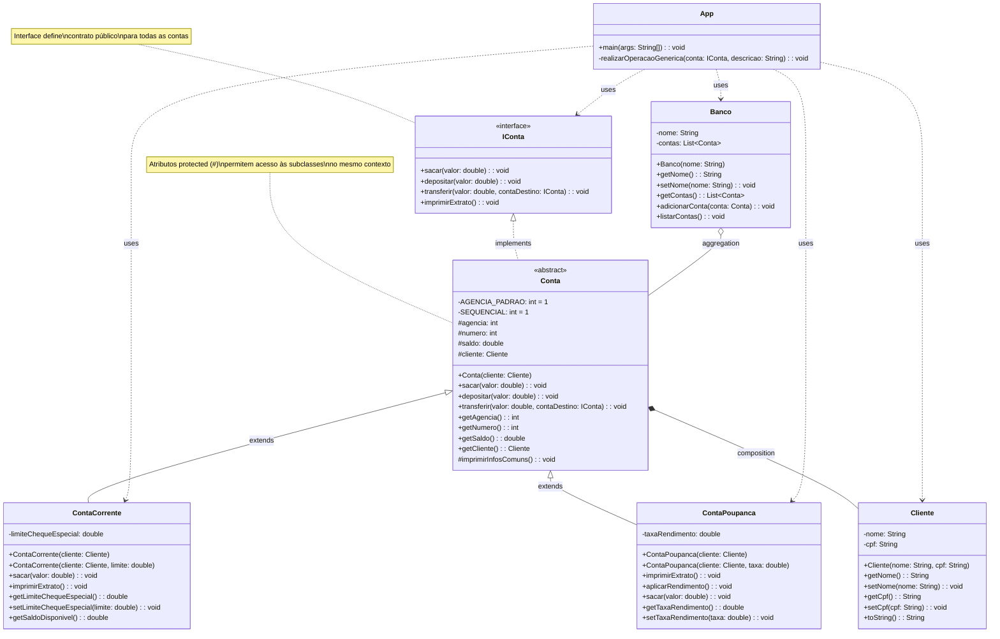

# Sistema Bancário Digital - Java

Este projeto demonstra a implementação de um sistema bancário simples em Java, aplicando os quatro pilares fundamentais da Programação Orientada a Objetos.

## 🎯 Objetivos

Implementar um sistema bancário que demonstre:
- **Abstração**: Interface IConta e classe abstrata Conta
- **Encapsulamento**: Atributos privados e métodos públicos controlados
- **Herança**: ContaCorrente e ContaPoupanca herdam de Conta
- **Polimorfismo**: Tratamento genérico através da interface IConta

## 🏗️ Arquitetura do Sistema

### Classes e Interfaces

1. **IConta (Interface)**
   - Define as operações básicas: sacar, depositar, transferir, imprimirExtrato
   - Demonstra **Abstração** ao definir apenas os métodos essenciais

2. **Conta (Classe Abstrata)**
   - Implementa funcionalidades comuns a todas as contas
   - Atributos: agencia, numero, saldo, cliente
   - Demonstra **Encapsulamento** e serve como base para **Herança**

3. **ContaCorrente (Classe Concreta)**
   - Herda de Conta
   - Funcionalidade específica: cheque especial
   - Permite saldo negativo até o limite

4. **ContaPoupanca (Classe Concreta)**
   - Herda de Conta
   - Funcionalidades específicas: rendimento mensal, não permite saldo negativo
   - Método exclusivo: aplicarRendimento()

5. **Cliente**
   - Representa o titular da conta
   - Demonstra **Encapsulamento** com atributos privados

6. **Banco**
   - Gerencia as contas do sistema
   - Mantém lista de contas e operações administrativas

### Diagrama UML - Estrutura do Sistema



### Legenda do Diagrama

**Modificadores de Acesso:**
- `+` **public**: Acessível por qualquer classe
- `-` **private**: Acessível apenas pela própria classe  
- `#` **protected**: Acessível por subclasses
- `~` **package-private**: Acessível apenas por classes do mesmo package (não usado neste projeto)

**Relacionamentos:**
- `implements` (linha tracejada com triângulo): Implementação de interface
- `extends` (linha sólida com triângulo): Herança entre classes
- `composition` (linha com losango preenchido): Composição forte
- `aggregation` (linha com losango vazio): Agregação fraca  
- `uses` (linha tracejada): Dependência/uso

**Estereótipos:**
- `<<interface>>`: Indica uma interface
- `<<abstract>>`: Indica uma classe abstrata

### Análise dos Conceitos de POO no Diagrama

#### 🎯 **Abstração**
- **Interface IConta**: Define o contrato público sem implementação
- **Classe abstrata Conta**: Fornece estrutura comum sem permitir instanciação direta
- **Foco no essencial**: Apenas operações bancárias fundamentais são expostas

#### 🔒 **Encapsulamento**
- **Atributos privados (-)**: `nome`, `cpf`, `limiteChequeEspecial`, `taxaRendimento`
- **Atributos protected (#)**: `agencia`, `numero`, `saldo`, `cliente` (acessíveis por subclasses)
- **Métodos públicos (+)**: Interface controlada para acesso aos dados
- **Validações internas**: Lógica de negócio protegida dentro dos métodos

#### 🧬 **Herança**
- **ContaCorrente extends Conta**: Reutiliza funcionalidades básicas
- **ContaPoupanca extends Conta**: Especializa comportamentos específicos
- **Atributos protected**: Permitem acesso direto pelas subclasses
- **Sobrescrita de métodos**: `sacar()` e `imprimirExtrato()` têm comportamentos específicos

#### 🎭 **Polimorfismo**
- **IConta como tipo genérico**: Permite tratar diferentes tipos de conta uniformemente
- **Método `sacar()` polimórfico**: Comportamento diferente em cada subclasse
- **Array de IConta**: Pode conter qualquer implementação da interface
- **Flexibilidade**: Novos tipos de conta podem ser adicionados facilmente

## 🔍 Conceitos de POO Demonstrados

### 1. Abstração
- **Interface IConta**: Define apenas os métodos essenciais sem implementação
- **Classe abstrata Conta**: Estrutura comum sem permitir instanciação direta

### 2. Encapsulamento
- Atributos privados em todas as classes
- Acesso controlado através de métodos públicos (getters/setters)
- Validações nos métodos de negócio

### 3. Herança
- ContaCorrente e ContaPoupanca estendem a classe Conta
- Reutilização de código da classe pai
- Especialização com funcionalidades específicas

### 4. Polimorfismo
- Tratamento uniforme através da interface IConta
- Mesmo método (sacar) com comportamentos diferentes nas subclasses
- Arrays e métodos genéricos que aceitam qualquer implementação de IConta

## 🚀 Funcionalidades Implementadas

### Operações Básicas
- ✅ Depósito
- ✅ Saque (com validações específicas por tipo de conta)
- ✅ Transferência entre contas
- ✅ Consulta de saldo e extrato

### Funcionalidades Específicas

#### Conta Corrente
- Cheque especial configurável
- Permite saldo negativo até o limite
- Aviso quando usar o cheque especial

#### Conta Poupança
- Taxa de rendimento configurável
- Aplicação de rendimento mensal
- Não permite saldo negativo
- Proteção contra saques sem saldo

## 🎮 Como Executar

### Pré-requisitos
- Java JDK 8 ou superior
- Sistema operacional: Windows, macOS ou Linux

### Compilação e Execução

#### Versão Padrão (Estrutura Atual)
```bash
# Navegar para o diretório do projeto
cd banco-digital

# Compilar todos os arquivos
javac -d . src/*.java

# Executar a aplicação
java -cp . App
```

#### Versão Alternativa (Mesmo Resultado)
```bash
# Navegar para o diretório do projeto
cd banco-digital

# Compilar todos os arquivos (estrutura atual)
javac -d . src/*.java

# Executar a aplicação
java -cp . App
```

### Estrutura de Arquivos

```
src/
├── App.java (classe principal)
├── IConta.java (interface)
├── Cliente.java
├── Conta.java (abstract)
├── ContaCorrente.java
├── ContaPoupanca.java
└── Banco.java
```

**Benefícios da Organização Estruturada:**
- ✅ **Simplicidade**: Estrutura direta e fácil de entender
- ✅ **Rapidez**: Compilação e execução mais simples
- ✅ **Aprendizado**: Foco nos conceitos de POO sem complexidade adicional
- ✅ **Clareza**: Todas as classes visíveis no mesmo diretório
- ✅ **Didático**: Ideal para projetos educacionais e protótipos

## 📊 Exemplo de Uso

O sistema demonstra:

1. **Criação de clientes e contas**
2. **Depósitos iniciais**
3. **Operações de saque** (com diferentes comportamentos)
4. **Transferências entre contas**
5. **Aplicação de rendimento** (específico da poupança)
6. **Demonstração de polimorfismo** com arrays de IConta

### Saída Esperada
```
=== SISTEMA BANCÁRIO DIGITAL ===

=== CRIANDO CLIENTES ===
Cliente: João Silva (CPF: 123.456.789-01)
Cliente: Maria Santos (CPF: 987.654.321-02)
Cliente: Pedro Oliveira (CPF: 456.789.123-03)

=== OPERAÇÕES BANCÁRIAS ===
João sacando R$ 200,00 da conta corrente:
Saque de R$ 200,00 realizado com sucesso na Conta Corrente!

Maria tentando sacar R$ 1000,00 da conta corrente:
Saque de R$ 1000,00 realizado com sucesso na Conta Corrente!
Você está utilizando R$ 200,00 do seu cheque especial.

Pedro tentando sacar R$ 1500,00 da conta poupança:
Saldo insuficiente! Conta Poupança não permite saldo negativo.
```

## 🧠 Conceitos Aprendidos

### Abstração
- Foco apenas nos aspectos essenciais do domínio bancário
- Interface limpa e intuitiva para operações bancárias

### Encapsulamento
- Proteção de dados sensíveis (saldo, número da conta)
- Controle de acesso através de métodos validados
- Facilita manutenção e evolução do código

### Herança
- Reutilização de código entre tipos de conta
- Especialização sem duplicação
- Facilita adição de novos tipos de conta

### Polimorfismo
- Tratamento uniforme de diferentes tipos de conta
- Flexibilidade para adicionar novos tipos
- Código mais limpo e manutenível

## 📊 Benefícios do Diagrama UML

### 🎯 **Visualização Clara**
O diagrama Mermaid permite:
- **Compreensão rápida** da estrutura do sistema
- **Identificação visual** dos relacionamentos entre classes
- **Documentação viva** que evolui com o código

### 🔍 **Análise de Design**
Facilita a análise de:
- **Acoplamento**: Dependências entre classes
- **Coesão**: Responsabilidades bem definidas
- **Extensibilidade**: Pontos para futuras expansões
- **Manutenibilidade**: Impacto de mudanças

### 📚 **Ferramenta Educacional**
Demonstra visualmente:
- **Modificadores de acesso** e sua importância
- **Padrões de herança** e composição
- **Contratos de interface** vs implementação
- **Estrutura simples e didática** para aprendizado de POO

### 🚀 **Planejamento de Melhorias**

**Possíveis Extensões Visualizadas:**
- Adicionar `ContaInvestimento` ou `ContaSalario` (herança)
- Implementar `ITransacao` para histórico (nova interface)
- Criar classes utilitárias para operações auxiliares
- Desenvolver `BancoService` para regras de negócio complexas
- Organizar em packages para projetos maiores (estrutura enterprise)

---

*Projeto desenvolvido como parte do desafio de criação de um banco digital - DIO Trilha Java Básico*