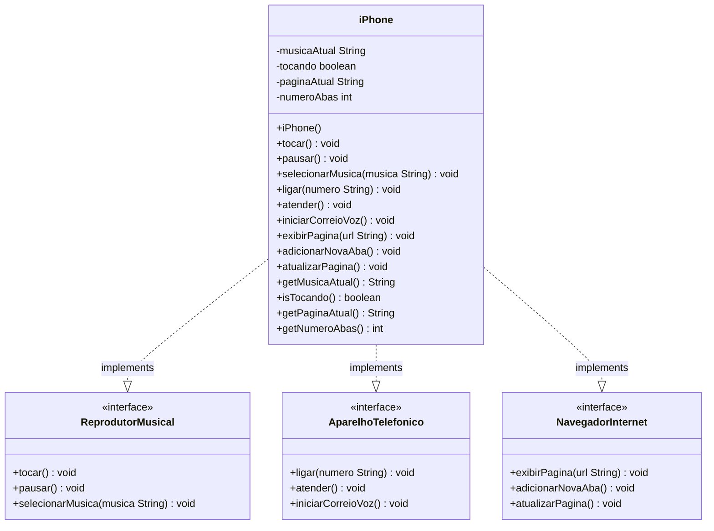

# Modelagem e Diagramação do Componente iPhone

Este projeto implementa a modelagem UML e o código Java para representar as funcionalidades do iPhone lançado em 2007, incluindo suas três principais funcionalidades: Reprodutor Musical, Aparelho Telefônico e Navegador na Internet.

## Estrutura UML

O projeto segue o padrão de design baseado em interfaces, onde o iPhone implementa múltiplas interfaces para suas diferentes funcionalidades:

### Diagrama UML - Mermaid



## Funcionalidades Implementadas

### 🎵 Reprodutor Musical
- `tocar()`: Inicia a reprodução da música atual
- `pausar()`: Pausa a reprodução da música atual  
- `selecionarMusica(String musica)`: Seleciona uma música específica

### 📞 Aparelho Telefônico  
- `ligar(String numero)`: Realiza uma ligação para o número especificado
- `atender()`: Atende uma chamada recebida
- `iniciarCorreioVoz()`: Inicia o correio de voz

### 🌐 Navegador na Internet
- `exibirPagina(String url)`: Exibe uma página web na URL especificada
- `adicionarNovaAba()`: Adiciona uma nova aba no navegador
- `atualizarPagina()`: Atualiza a página atual do navegador

## Estrutura do Projeto

```
src/
├── ReprodutorMusical.java     # Interface para funcionalidades musicais
├── AparelhoTelefonico.java    # Interface para funcionalidades telefônicas  
├── NavegadorInternet.java     # Interface para funcionalidades de navegação
├── iPhone.java                # Classe principal que implementa todas as interfaces
└── App.java                   # Classe para demonstração das funcionalidades

Diagramas UML:
├── uml-diagram.puml           # Diagrama UML em formato PlantUML
└── diagrama-mermaid.md        # Diagrama UML em formato Mermaid
```

## Como Executar

1. Compile o projeto:
   ```bash
   javac src/*.java -d bin/
   ```

2. Execute a aplicação:
   ```bash
   java -cp bin App
   ```

## Exemplo de Uso

```java
iPhone meuIphone = new iPhone();

// Reprodutor Musical
meuIphone.selecionarMusica("Imagine - John Lennon");
meuIphone.tocar();
meuIphone.pausar();

// Aparelho Telefônico
meuIphone.ligar("(11) 99999-9999");
meuIphone.atender();
meuIphone.iniciarCorreioVoz();

// Navegador Internet
meuIphone.exibirPagina("https://www.apple.com");
meuIphone.adicionarNovaAba();
meuIphone.atualizarPagina();
```

## Princípios de Design Aplicados

- **Interface Segregation Principle (ISP)**: Cada interface representa uma responsabilidade específica
- **Single Responsibility Principle (SRP)**: Cada interface tem uma única razão para mudar
- **Dependency Inversion Principle (DIP)**: O código depende de abstrações (interfaces) ao invés de implementações concretas
- **Composition over Inheritance**: O iPhone compõe funcionalidades através da implementação de múltiplas interfaces

## Tecnologias Utilizadas

- Java SE
- Paradigma de Orientação a Objetos
- Design Patterns (Strategy Pattern através de interfaces)

---

*Projeto desenvolvido como parte do desafio de modelagem UML do componente iPhone - DIO Trilha Java Básico*
