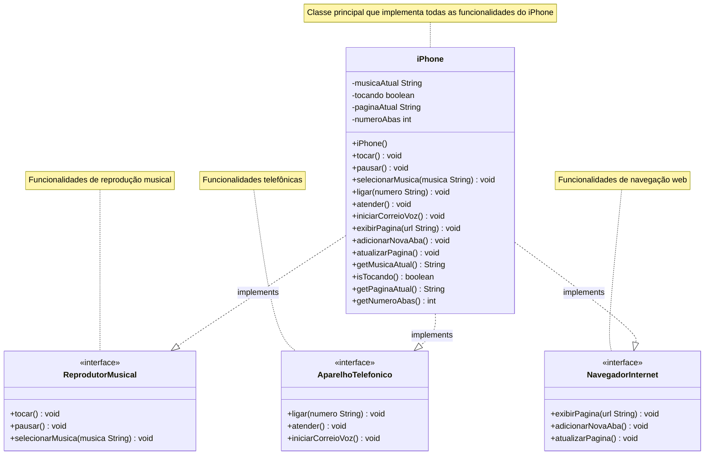

```mermaid
classDiagram
    class ReprodutorMusical {
        <<interface>>
        +tocar() void
        +pausar() void
        +selecionarMusica(musica String) void
    }
    
    class AparelhoTelefonico {
        <<interface>>
        +ligar(numero String) void
        +atender() void
        +iniciarCorreioVoz() void
    }
    
    class NavegadorInternet {
        <<interface>>
        +exibirPagina(url String) void
        +adicionarNovaAba() void
        +atualizarPagina() void
    }
    
    class iPhone {
        -musicaAtual String
        -tocando boolean
        -paginaAtual String
        -numeroAbas int
        +iPhone()
        +tocar() void
        +pausar() void
        +selecionarMusica(musica String) void
        +ligar(numero String) void
        +atender() void
        +iniciarCorreioVoz() void
        +exibirPagina(url String) void
        +adicionarNovaAba() void
        +atualizarPagina() void
        +getMusicaAtual() String
        +isTocando() boolean
        +getPaginaAtual() String
        +getNumeroAbas() int
    }
    
    iPhone ..|> ReprodutorMusical : implements
    iPhone ..|> AparelhoTelefonico : implements
    iPhone ..|> NavegadorInternet : implements
    
    note for iPhone "Classe principal que implementa todas as funcionalidades do iPhone"
    note for ReprodutorMusical "Funcionalidades de reprodução musical"
    note for AparelhoTelefonico "Funcionalidades telefônicas"
    note for NavegadorInternet "Funcionalidades de navegação web"
```
